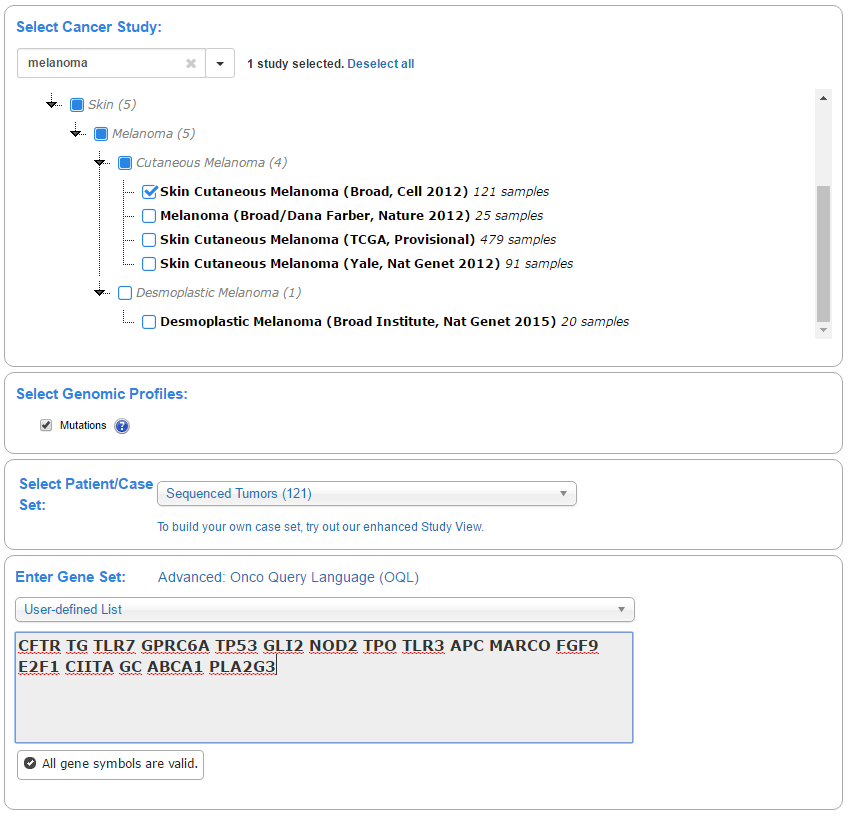
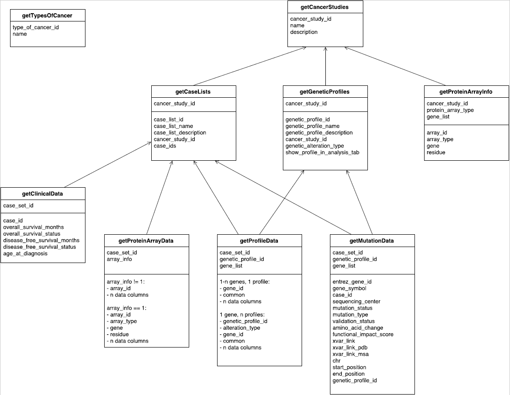
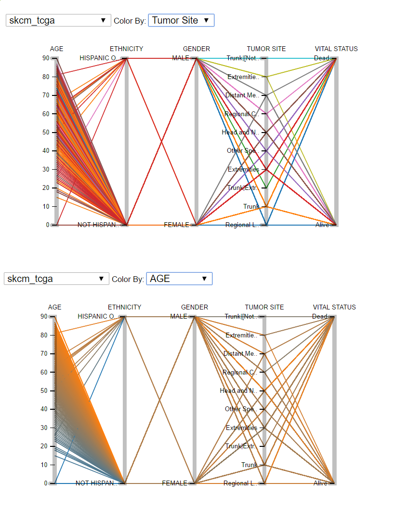
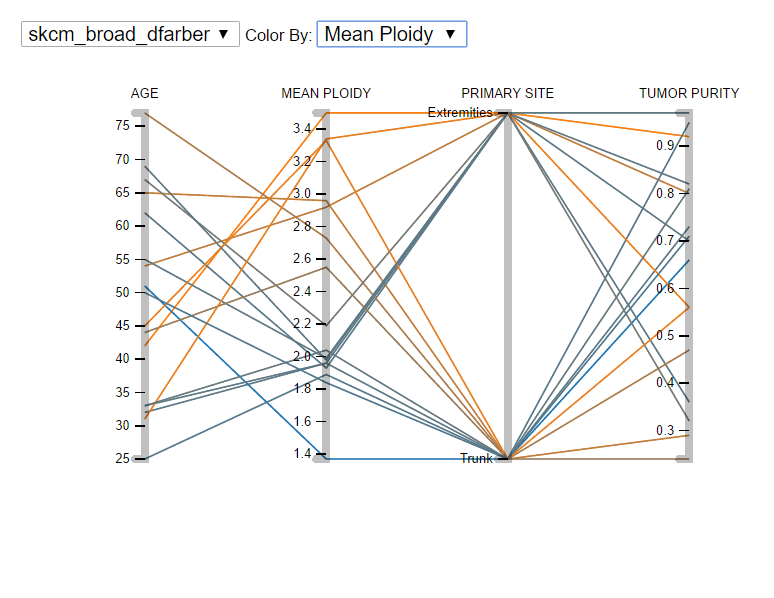
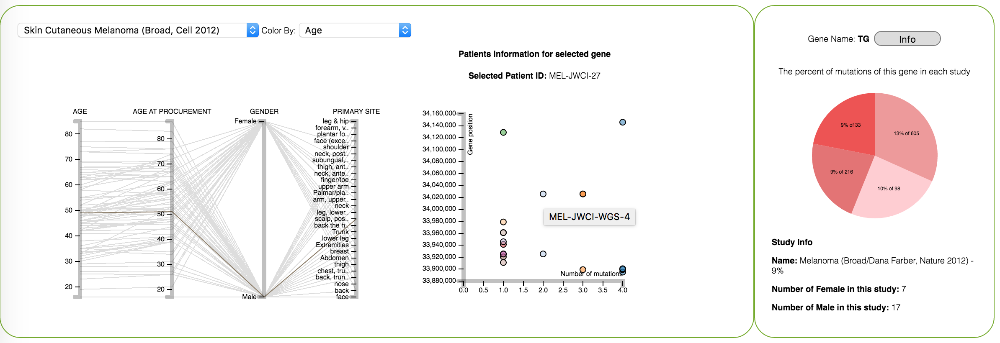

# Data Visualization Project 3
Project 3: Network visualization

- Link to the Video: https://youtu.be/SdsRduIigKY
- Link to the Demo: https://sonia2016.github.io/DataVisualizationProject3/


## Data description - Jeff

### cBioPortal sources

The data used for this project were pulled from [the cBioPortal web site](http://www.cbioportal.org/). Four
studies on skin cutaneous melanoma were selected:

  - [Melanoma (Broad/Dana Farber, Nature 2012)](http://www.cbioportal.org/study?id=skcm_broad_dfarber#summary)
  - [Skin Cutaneous Melanoma (Broad, Cell 2012)](http://www.cbioportal.org/study?id=skcm_broad#summary)
  - [Skin Cutaneous Melanoma (TCGA, Provisional)](http://www.cbioportal.org/study?id=skcm_tcga#summary)
  - [Skin Cutaneous Melanoma (Yale, Nat Genet 2012)](http://www.cbioportal.org/study?id=skcm_yale#summary)

17 genes were selected for our analysis; these genes are represented by the following symbols: 

CFTR; TG; TLR7; GPRC6A; TP53; GLI2;
NOD2; TPO; TLR3; APC; MARCO; FGF9;
E2F1; CIITA; GC; ABCA1; PLA2G3

Data sources within the cBioPortal site included downloadable TSV files and Web API methods.

### TSV files

Data representing the genes' mutual exclusivity were obtained in TSV files downloaded from the cBioPortal site.
For each of the four studies, a file was downloaded from the study's summary page as follows:

  1. Visit the [cBioPortal home page](http://www.cbioportal.org/index.do) and scroll down to the Query tab.
  2. Select the individual study. (The individual study must be selected, as the options differ when multiple 
  studies are selected.)
  3. For Genomic Profiles, select Mutations.
  4. For Select Patient/Case Set, select Sequenced Tumors.
  5. For Enter Gene List, select User-defined List and enter the 17 gene symbols.
      The following screenshot illustrates these options.
      

  6. When the results are displayed, click the Mutual Exclusivity tab, scroll to the end of the page, and
      click Download Full Result.
  7. Rename the downloaded file `mutex_result [study_id].txt`.

Once the four TSV files were downloaded, they were preprocessed using parseMutexFiles.py. This script parsed
the files, converted the data into an array of objects, and wrote the objects to `mutEx.json`. Here's a sample
of the json file contents:

  ```JavaScript
  [
    {
      "association":"Tendency towards co-occurrence",
      "geneA":"CFTR",
      "geneB":"TG",
      "logOddsRatio":"1.062054692934312",
      "pValue":"0.1093286163078594",
      "source":"skcm_broad"
    },
    {
      "association":"Tendency towards co-occurrence",
      "geneA":"CFTR",
      "geneB":"TLR7",
      "logOddsRatio":"1.2039728043259361",
      "pValue":"0.19841657023530174",
      "source":"skcm_broad"
    },
    // ...,
    {
      "association":"Tendency towards mutual exclusivity",
      "geneA":"ABCA1",
      "geneB":"PLA2G3",
      "logOddsRatio":"-Infinity",
      "pValue":"0.9780219780219295",
      "source":"skcm_yale"
    }
  ]
  ```

### Web API methods

The cBioPortal site provides a number of Web API methods [as described here](http://www.cbioportal.org/web_api.jsp).

The following diagram illustrates these methods and their dependencies:



Our application code includes calls to each of the nine API methods; however, only the `getClinicalData` and
`getMutationData` methods were used ultimately in our visualizations.

To eliminate blocking method calls and increase the responsiveness of our application, our `XMLHttpRequest`
calls are wrapped in ES6 Promises. This feature is supported by most modern browsers, with the notable
exception of IE 11.


## Cancer selection 
We chose to work on the Melanoma skin cancer based on the Melanoma is the least common but the most deadly skin cancer, accounting for only about 1% of all cases, but the vast majority of skin cancer death.
In 2016, it is estimated that there will be 76,380 new cases of melanoma in the United States and 10,130 deaths from the disease.

The frequency of cancer can be find in the world map location. And also by mouse over on each bubble you can see the frequency and also name of that location.

By pressing on the image you direct to the page that shows you more detail about the gene information.


### Gene/Protein Selector
This panel provides an overview of a subset of millions of index cards in the database, such as protein interaction within the *cos-7* cell line. Users can select any protein within this overview network to start with. Users also have the option to instead input protein name into a search box as depicted in the left panel of the following figure. This will perform a request to load the selected protein and its immediate neighbors from our index card database. As users iteratively expand the subnetwork in the main view, the overview keeps track of the expanded sub-network over the overall context as depicted in the right panel.
As we mentioned in the data description section, we worked with 17th genes because we choose Melanoma Cancer for working and it has 4 studises related to this cancer in cbioPortal and we intersect the genes between these four and the current template finally we have 17th genes/proteins for work.


### Gene/Protein Networks View
In this view, node (protein) sizes are computed based on the number of direct neighbors. Edges (index cards) are color-encoded by interaction types. BioLinker supports finding paths between selected proteins. The following figure shows an example. Users specify source, target, and the maximum number of hops in between source and target. BioLinker displays all possible paths under that condition. Source node is pinned to the left while target node is pinned to the right of the visualization. The shortest path from *PIK3CA* to *TRAF6* goes through two hops *Akt* and *NF-kappaB*. In this example, we also overlay cancer genomics data onto the network: purple nodes are proteins with high copy number alteration in the Bladder Urothelial Carcinoma study (TCGA, Nature 2014). BioLinker accesses this cancer study on [cBioPortal](http://www.cbioportal.org/) through its web service interface.

After selecting the gene APC you can see the network of these gene


## Gene Information
Whenever you select a gene amongst these genes, our application shows:

1. Information related to the each study
2. Information related to the positions and number of mutation of this gene in patients that have mutation on these gene

## Parallel Coordinate - Study Information - Maede
In the parallel Coordinate graph we show the information related to each study. Each study has some information about the patient involved in that study. The informations for each study is different in two sense. 1)The patient Id's are different. 2) The parametes are different. For example in one study we have "gender" but not in another. So what we did was to select the more important parameters in each study and show them in parralle coordinates when that study was selected. The parameters in each study are either numerical or categorical. The color of lines can change based on both numerical and categorical category. If the parameter which is selected for coloring is numerical then the color will change in the range of blue to orange. However if the parameter selected is categorical the color will change categorically because the rangedoes not show any relation between categories any more. The picture below illutrates this. The "Tumor Site" parameter is a categorical parameter and as you see the coloring in it is caegorical. But n the same study if we chose to color by age we see that colors appear in a range



The reason we selected the parrallel coordinate is that the study informtion is more about the demograohy of the study. With this graph we can notice, first of all, the range of each parameters very easily. Second, we can wee some relations between the parametes quite easily. For example in the picture below you ca easilty infer that the higher the age is the lower the mean polidity and vise versa. 



The colors in parrallel coordinates is also connected to the colors in the scatterplot which will be explained in the next section. 

## Pie chart - Gene information in study - Sonia
In pie chart we show the percentage of muation of the selected gene in corresponding study and also the number of female and male in each study.


If you click in each part of the pie chart it shows the corresponding information related to the selected study and percentage of mutation of the selected gene in that study and by double click you can reset the tooltip


If you press the Info button it goes to the anothe webpage that shows you detailed description and information related to the selected gene.


## Scatter plot - Patient infromation - Sonia
By selecting the gene, the scatter plot we show the list of patients in two dimension, number of mutations and position (start and end positions) of the selected gene in those patients.


Each patient (sample) related to this gene means has mutation on the selected gene and also this gene can be appeared in different location in his/her chromosome. So, in this plot we are showing the list of patients that have muation on the selected gene by considering the position and number of mutations. 


If you mouse over on each dot, the title of that dot will be appear in your screen that is patient(sample) id.

      
If you click on the one circle (patient) on the scatter plot you can see the related information of that specific patient on the parallel cordinate. Such as; age, geneder, ... . You can see the patient ID on the top of the scatter plot and the selected circle color would be black.


By double click on the each dot you will reset the tooltip and also the parall cordinate.


If you change the study the scatter plot would be updated based on the information of that study for the selected gene. Therefore, we have the list of patients in the selected study based on the selected gene.


#### Claim
Our first claim was the relation between the position and number of mutation but as you can see in the diagram they are not related so far!


## Group Schedule

### First Meeting - November 18th
#### Check the problem definition
We check the cbioportal webpage for obtaining the data.
In data set tab, we open the one of the cancer studies and after that downloaded the data "Download Data". In that folder we need the file called "data_mutations_extended.txt".

- [X] Check how to connect to the web application and obtain related data to the specific study
- [X] Reading the study and figure out which information (Maede and Sonia)
  1. Gene
  2. Study or disease
    1. which info in those studies are important such as gender
- [X] Decide which types of visualization do we want to select (pie, plot, ...) (at this step - Maede and Sonia)

##### Next meeting Monday 21st 2:30pm

### Second Meeting - November 21st
Discuss about what we did and deliever what we done so far, you can check them in our action list.
We talked and prepared the first draft of our visualization and made decision to work on which data/categories/studies.

- [X] Finalize the data in webservice - Jeff
- [X] Working on parallel cordinate for each study - Maede
- [X] Working with gene detail/ location of the gene/ statistics of the special gene on four studies- Sonia

##### Next meeting Friday 25th 2:00pm


### Third Meeting - November 25th
Each of us was working on the understanding the concept related to the cancer to how to visualize the most important of them.
According too much work and not understandable data in this webpage we decided to determine our work by our preference.
We want to work just 4 studies (related to Melanoma: one of us has family history about this disease) and we decided to partition our work in parallel.

- [X] Complete the data obtaining from the webpage - Jeff
- [X] Working on how to visualize the data related to the each study (which/how) - Maede
- [X] Find the criteria for visualizing the gene interaction and network of them - Sonia

##### Next meeting Monday 28th 4:30pm

### Forth Meeting - November 28th
We discussed according to how to represent the gene interaction. With discussion with Dr. Dang we figured out we shouldn't wory about the gene networks. We should just work on the study and related gene in those studies.

- [X] Wokring on the data - Jeff
- [X] Working on parallel cordinate for each study - Maede
- [X] Working on the basic template to understand how to work on that and also work with the gene data - Sonia

##### Next meeting Monday 30th 4:30pm

### Fifth Meeting - November 30th
We discussed about the visualization of the data that we already have and check the position of them in the current template and how we connect our data with existance data.

- [X] Working on parallel cordinate color by selecting the different dimensions - Maede
- [X] Working on scatter plot for showing the position of genes, pie chart for the percentage of muation of searched gene - Sonia
- [X] Working on the map for showing the distributation of cancer in different locations of the world - Sonia

### Sixth Meeting - December 5th
We implement the parallel cordianate, scatter plot, and pie chart for visualization of the current data that we have. 

- [X] Linking between scatter plot and parallel cordinate, change the data of scatter plot, and number of females and males in each study - Sonia

###### Some of our Action List
- Sonia
  1. I was comparing this two studies
    1. http://www.cbioportal.org/study?id=brca_metabric#summary
      1. it has 2509 patients
    2. http://www.cbioportal.org/study?id=brca_tcga_pub2015#summary
      1. It has 114 patients
  2. By comparing these two studies and browsing the data related to each of them I figured out they have multiple differences such as:
    1.  CNA data (second)
    2.	Cent17 (second)
    3.	HER2 status (first)
    4.	Neoplasm disease stage American joint community code (second)
    5.	Neoplasm histologic grade (first)
  3. Therefore, we can conclude that different studies have different domain for comparison and they consider different factor for their studies. The good news is that, we have whole data related to each factor in each study data. 
  4. Our first goal is that how to represent those data and also how to obtain those information from website (the query)
  5. The other goal is that we should connect different plot to each other for example
    1.	Number of mutations, gender, diagnosis age, CNA gene and etc.
  6. I also checked this paper "Cancer Genome Landscape", but I fortunately I didn't find any similarities between studies and this paper for good understand
    1. I think we should decide on which type of disease we want to work. Hence, we can focus on the parameters that are important for that disease, and ask questions from experts
  6. Note
    1.	Based on the dataset we have 147 different studies 
    2.	The current template that professor gave us has 126 different studies
  
- Jeff
  1. I was able to begin converting the web api calls from the AngularJS application to pure JavaScript. I've put together a barebones site that includes a call to the method that returns the list of all studies.
  2. The service objects use Promises to defer execution until the web api calls return; these are supported by Chrome.
  3. Next up will be to add the remaining api calls so we can pull the rest of the data as needed.

- Maede

  I did some study of the structure of data we have and the template that the professor gave us and found the following:
 1. In the data set that we obtain from cbiPortal, in the folder for each study (for example paac_jhu_2014) we have a file called *data_mutations_extended.txt*. The first column in this file is Hugo_Symbol which is another identifier for a gene. A gene is identified either by Hugo gene symbol or gene aliases.
 2. Whatever we have in the network template of professor is not gene name or alias, but ....
 3. What we have to do is to 
  1) start from "data_mutations_extended" get the genes involved in that study
	2) put all the gene names in the search box
 	3) The linkes in the network corresponds to the number of times two gene appear together in on study
 	4) assume we have selected two related genes, then when we click on one of the genes 
 		- a drop down list should appear and we have to select a "numeric" parameter (from data_mutations_extended : e.g. Chromosome, start position ..)
 		- we have to show the value of that parameter in different studies.
 		- when clicked on a study we show the related information in the study i.e. the file "study_view_clinical_data"
 			parameters like cancer type, age of the patients, gender, sample size, ....
 		
 4. We can also start from study and go to gene. For example we will have a drop down list containng the studies. when we click on a study
 	we see a graph containing the gene names and their mutation number.
